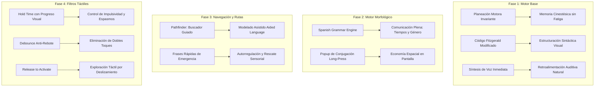

# 🦁 MatataTalk: Comunicación Aumentativa y Alternativa (CAA) de Nueva Generación
### *Democratizando la voz y la autonomía para personas en el espectro autista*
**En honor y dedicación a Mateo Rafael ("Matata") 💙**

---

## 🌟 1. Propósito y Misión

**MatataTalk** es un comunicador aumentativo y alternativo (CAA) de código abierto y alta tecnología diseñado para personas no verbales, con autismo, dispraxia verbal o parálisis cerebral. 

Nace de la necesidad real de un padre que busca darle a su hijo **Mateo Rafael** una herramienta de comunicación equivalente o superior a los estándares clínicos de la industria (como *Proloquo2Go*), pero accesible de forma universal en Android, libre de barreras económicas o licencias restrictivas.

```
                  ┌────────────────────────────────────────┐
                  │          MATEO RAFAEL ("MATATA")       │
                  │   Inspiración, Amor y Voz del Proyecto │
                  └───────────────────┬────────────────────┘
                                      │
          ┌───────────────────────────┴───────────────────────────┐
          ▼                                                       ▼
┌──────────────────────────────────┐            ┌──────────────────────────────────┐
│        RIGOR CLÍNICO CAA         │            │     TECNOLOGÍA ABIERTA & LIBRE   │
│ • Planeación motora invariante   │            │ • Multiplataforma (Flutter/FVM)  │
│ • Gramática natural en español   │            │ • Gráficos ARASAAC libres        │
│ • Adaptación táctil y sensorial  │            │ • Sin muros de pago ni compras   │
└──────────────────────────────────┘            └──────────────────────────────────┘
```

---

## 🧠 2. El Desafío Clínico en el Autismo No Verbal

El lenguaje oral no es la única vía para comunicarse. Las personas en el espectro autista con desafíos del habla enfrentan múltiples barreras que impactan su bienestar emocional y desarrollo cognitivo:

1. **Frustración y Crisis (*Meltdowns*):** La imposibilidad de comunicar dolor, hambre, necesidades fisiológicas o sobrecarga sensorial genera altos niveles de ansiedad y desregulación.
2. **Fatiga Cognitiva:** Los sistemas tradicionales mal diseñados obligan al usuario a "buscar visualmente" cada pictograma en lugares distintos, sobrecargando su memoria de trabajo.
3. **Lenguaje Telegráfico:** Muchas herramientas limitan al usuario a palabras sueltas en infinitivo (*"yo comer"*), impidiendo el desarrollo de una comunicación rica y gramaticalmente estructurada.
4. **Desafíos Motores Finos:** Movimientos espasmódicos, temblores o toques repetitivos involuntarios dificultan el uso de pantallas táctiles convencionales.

---

## 🗺️ 3. Mapeo: Features del Roadmap e Impacto Terapéutico

A continuación se presenta el análisis detallado de cada componente de **MatataTalk**, explicando la solución técnica y su impacto clínico directo.



---

### 🟢 FASE 1: Motor Base & Cuadrícula Motora
*Fundamentos del Lenguaje y Memoria Kinestésica*

| Feature Técnico | Descripción | 🎯 Impacto Terapéutico en el Autismo |
| :--- | :--- | :--- |
| **Invarianza Espacial (*Motor Planning*)** | Los pictogramas esenciales permanecen fijos en la misma coordenada `(fila, columna)` en todo momento. | **Memoria Cinestésica:** El cerebro del usuario automatiza el movimiento de la mano (como al tocar el piano). No necesita escanear visualmente la pantalla cada vez, reduciendo la sobrecarga cognitiva y agilizando el habla. |
| **Código de Colores Fitzgerald Modificado** | Clasificación cromática estandarizada (Verbo = Verde, Pronombre = Amarillo, Sustantivo = Naranja, Social = Rosa). | **Estructuración Semántica:** Facilita la comprensión de las funciones gramaticales de las palabras mediante anclaje visual de alto contraste. |
| **Integración de ARASAAC** | Renderizado vectorial de alta nitidez de símbolos reconocidos internacionalmente. | **Comprensión Simbólica Universal:** Facilita la transición entre el pictograma físico (PECS) y el comunicador digital dinámico. |
| **Síntesis de Voz en Español (TTS)** | Pronunciación instantánea palabra por palabra y frase completa con cadencia ajustada. | **Círculo de Comunicación:** El usuario escucha el modelo sonoro correcto de la palabra, fortaleciendo el feedback auditivo y la comprensión del lenguaje oral. |

---

### 🟣 FASE 2: Motor Morfológico & Gramática Dinámica
*Evolución del Lenguaje Telegráfico a la Expresión Plena*

| Feature Técnico | Descripción | 🎯 Impacto Terapéutico en el Autismo |
| :--- | :--- | :--- |
| **Motor de Conjugación en Español (`SpanishGrammarEngine`)** | Algoritmo lingüístico para verbos regulares (`-ar, -er, -ir`) e irregulares clave (*querer, ir, jugar, tener, poder, estar*). | **Expresión Temporal Precisa:** Permite comunicar no solo lo que ocurre ahora, sino recordar vivencias pasadas (*"ayer comí"*) o anticipar eventos futuros (*"mañana jugaré"*), crucial para la autorregulación y la anticipación en autismo. |
| **Popup Morfológico por Pulsación Sostenida (*Long-Press*)** | Al mantener presionado un botón, se despliega una rueda/matriz con todas las conjugaciones y concordancias. | **Economía de Pantalla:** Evita llenar el tablero con decenas de botones repetidos para un mismo verbo, manteniendo la cuadrícula limpia y ordenada. |
| **Pluralización y Género Automático** | Ajuste morfológico para sustantivos y adjetivos en español. | **Dignidad Comunicativa:** Fomenta la construcción de oraciones gramaticalmente completas y naturales (*"manzanas rojas"* en vez de *"manzana rojo"*). |

---

### 🔵 FASE 3: Navegación Avanzada, Buscador Guiado & Frases Rápidas
*Modelado Clínico, Orientación y Rescate en Crisis*

| Feature Técnico | Descripción | 🎯 Impacto Terapéutico en el Autismo |
| :--- | :--- | :--- |
| **Buscador Guiado (*Word Pathfinder*)** | Búsqueda predictiva que calcula y visualiza la ruta motora exacta (`Inicio ➔ Comida ➔ Manzana`). | **Modelado Asistido (*Aided Language Input*):** Terapeutas y padres pueden enseñar dónde está una palabra modelando la ruta paso a paso sin intervenir físicamente la mano del niño. |
| **Modo Guía con Halo Azul** | Resalta con un halo azul luminoso el botón siguiente en la pantalla hasta alcanzar el pictograma buscado. | **Focalización de la Atención:** Reduce la desorientación visual en tableros extensos, guiando la mirada de forma suave y predecible. |
| **Panel de Frases Rápidas (*Quick Phrases*)** | Acceso en un toque a frases de emergencia fisiológica (*"baño"*, *"hambre"*, *"sed"*), sociales y sensoriales. | **Respuesta Inmediata a Crisis:** En momentos de desregulación sensorial, el usuario no puede construir una frase compleja; un solo toque comunica su necesidad crítica de forma instantánea. |
| **Categoría Sensorial Específica 💙** | Expresiones de autorregulación: *"Hay mucho ruido"*, *"Necesito un descanso"*, *"No me toques por favor"*. | **Defensa y Autonomía Sensorial:** Empodera a la persona autista para defender sus límites sensoriales en la escuela, el hogar o la vía pública, previniendo sobrecargas. |
| **Historial Reactivo de Comunicación** | Registro cronológico con repetición rápida y guardado en favoritos. | **Ritmo y Repetición:** Permite al usuario repetir un mensaje reciente con un solo toque, facilitando la fluidez en conversaciones cotidianas. |

---

### 🟠 FASE 4: Accesibilidad Universal & Filtros Motores
*Adaptación Táctil a la Diversidad Motriz y Neurodivergente*

| Feature Técnico | Descripción | 🎯 Impacto Terapéutico en el Autismo |
| :--- | :--- | :--- |
| **Tiempo de Retención (*Hold Time*)** | Requiere mantener el botón presionado (ej. 0.3s - 0.8s) para activarlo, con animación circular de progreso. | **Freno a la Impulsividad y Espasmos:** Filtra los toques accidentales por roce, aleteos cerca de la pantalla o toques impulsivos desregulados. El progreso visual le enseña al usuario la noción de causa-efecto controlada. |
| **Filtro Anti-Rebote (*Debounce Time*)** | Bloquea pulsaciones dobles o triples repetitivas en un intervalo corto (ej. 300ms - 600ms). | **Evitación de Frustración:** Evita que el sintetizador de voz repita erráticamente la misma palabra varias veces por espasmos musculares. |
| **Modo Activar al Soltar (*Release to Activate*)** | El botón se activa cuando el dedo se levanta de la superficie, no cuando la toca por primera vez. | **Exploración Táctil Segura:** Permite a usuarios con dificultades visomotoras deslizar el dedo por la pantalla sintiendo los botones y soltarlo únicamente cuando alcanzan el pictograma deseado. |
| **Retroalimentación Háptica (Vibración)** | Vibración suave al confirmar exitosamente la acción. | **Canal Sensorial Somatosensorial:** Confirma físicamente la activación de la palabra, ofreciendo una sensación táctil reconfortante para usuarios que buscan estimulación propioceptiva. |

---

## 📊 4. Comparativa: MatataTalk frente a Soluciones del Mercado

| Criterio | Software Propietario (iOS) | Apps Gratuitas Genéricas | 🦁 MatataTalk |
| :--- | :---: | :---: | :---: |
| **Costo para la Familia** | \$250 - \$300 USD + Hardware Apple | Gratis (con publicidad/incompleta) | **100% Gratuito y Libre (Open Source)** |
| **Plataformas Soportadas** | Solo iPad / iPhone | Android básico | **Android Universal (y Multiplataforma)** |
| **Planeación Motora Invariante** | ✅ Sí | ❌ No (listas alfabéticas o dinámicas) | **✅ Sí (Invarianza estricta)** |
| **Morfología Completa en Español** | ✅ Sí | ❌ No (solo infinitivos) | **✅ Sí (Motor lingüístico dedicado)** |
| **Buscador Guiado (*Pathfinder*)** | ✅ Sí | ❌ No | **✅ Sí (Guía visual paso a paso con halo azul)** |
| **Filtros Táctiles y Adaptación Motriz** | ✅ Parcial | ❌ No | **✅ Sí (Hold time, Debounce, Release, Háptica)** |
| **Enfoque en Regulación Sensorial** | ❌ Genérico | ❌ Genérico | **✅ Específico para Autismo (💙)** |

---

## 🚀 5. Próximos Pasos en el Roadmap

1. **Fase 3 (Finalización):** Integración de base de datos **Drift / SQLite** para indexar todo el diccionario ARASAAC offline sin requerir conexión a internet.
2. **Fase 4 (Ampliación):** Sistema de barrido por conmutadores externos Bluetooth (*Switch Scanning*) para usuarios con movilidad reducida extrema.
3. **Fase 5 (Ecosistema):** Soporte del formato estándar **Open Board Format (`.obf` / `.obz`)** para permitir a terapeutas importar y exportar tableros personalizados de cualquier institución del mundo.

---

## 💙 6. Conclusión y Compromiso

> *"La comunicación es un derecho humano fundamental, no un privilegio costoso. MatataTalk demuestra que la tecnología abierta, guiada por el amor familiar y el rigor clínico, puede transformar la vida de niños como Mateo y de miles de personas no verbales en todo el mundo."*
